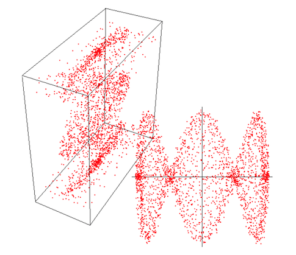

# Principal Component Analysis

This essay was written in preparation for a talk I gave in our research group at the _UC Irvine_’s _Data Mining_ group. Originally written on October 17, 2000.

## Creator

That would be me, _Wagner Truppel_. If you need or want to contact me, send a message to `wagner` at `restlessbrain` dot com.

## License

I'm sharing this work under the [Creative Commons Attribution-ShareAlike 4.0 International (CC BY-SA 4.0)](http://creativecommons.org/licenses/by-sa/4.0/) license. See the LICENSE file for more information.
